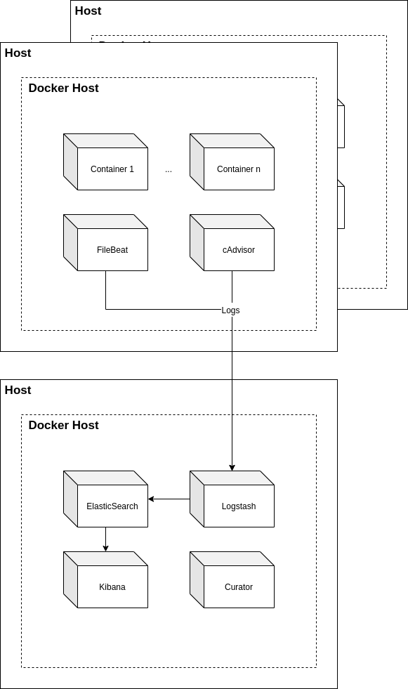

Deployment
==========

****
Monitoring
****

   Overview of the logging and monitoring infrastructure

Due to the deployment in Docker containers, it is possible to collect all stdout logs from Docker's central logging directory. With the tool "Filebeat" this process is automated and all logs are being sent to a central ELK Stack, located on a different server. This allows for the following advantages:

+ High searchability
+ redundancy
+ guided automation of common tasks
+ GUI

Which outweigh the disadvantages:

- higher complexity
- more points of failure